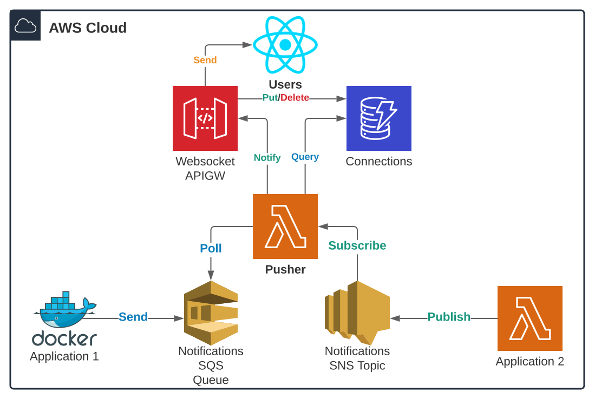

# AWS API Gateway Websocket Asynchronous Pusher


Fast AWS API Gateway websockets notifications' pusher using Python AsyncIO for managing asynchronous and concurrent
non-blocking IO calls to DynamoDB connections store and API Gateway management API. making it suitable for broadcasting
messages to multiple users with a fast and cost-effective approach.

You can test the Pusher with [this demo application](https://github.com/obytes/apigw-websocket-pusher) or use the live 
demo at https://sumu.kodhive.com

## Features

- **Multiple sources**: capable of receiving notification requests from SQS and SNS, which make it suitable for
  processing single notification request from SNS and high number of notification requests in batches when polling 
  from SQS

- **Multicast Notifications**: the pusher can send messages to only a subset of users (eg: users in a chat room).

- **Broadcast Notifications**: sometimes you just want to send the same message for all connected users (eg: broad
  announcements)

- **Exclusion Notifications**: the pusher can broadcast messages to all users except a list of excluded users (eg: 
  online/offline  presence events can be sent to all except the originator)

- **Stale Connections Pruning**: capable of detecting and deleting stale connections from DynamoDB connections store
  in case API Gateway missed cleaning them.

- **Asynchronous Processing**: the pusher is using AsyncIO to notify multiple users/connections concurrently to not
  wait for inflight requests to DynamoDB/API Gateway so you don't pay AWS the waiting time 😎

- **Batch Processing**: when using SQS as event source the Pushed will be able to process batches of notification
  requests, also concurrently.

- **Duplicate Users Detection**: able to detect duplicate users in a notification requests and make them unique set of
  users. to avoid double notifications.

## Requirements



- **DynamoDB Connections Store**: a DynamoDB table where users connections are stored, It should have a hash
  key **`user_id`** and a range key **`connection_id`**, where every user can have multiple connections and the Pusher 
  can retrieve specific user connections by querying with the hash key.

- **AWS API Gateway Websockets API**: an already configured Websocket API Gateway. the Pusher will use the connection
  management endpoint passed as environment variable to post messages to users.
  
- **SNS Topic**: the SNS Topic that the pusher will subscribe to for notifications requests.

- **SQS Queue**: the SQS Queue that the pusher will poll notifications requests from.

## Notification Requests

Backend applications can send notifications to AWS API Gateway Websocket connected users by sending a notification
request to the service integrated with the Pusher (SNS|SQS), notifications requests should meet the following format:

For Multicast notifications, the message should be a JSON String that contains the list of users and the actual `data`:

```python
import json

message = {
    "users": ["783304b1-2320-44db-8f58-09c3035a686b", "a280aa41-d99b-4e1c-b126-6f39720633cc"],
    "data": {"type": "notification", "message": "A message sent to multiple user"}
}
message_to_send = json.dumps(message)
```

For broadcast notifications, the same but do not provide users list or provide an empty users list:

```python
import json

message = {
    "data": {"type": "announcement", "message": "A broadcast to all users"}
}
message_to_send = json.dumps(message)
```

For exclusion notifications, instead of providing users list, provide a list of excluded users:

```python
import json

message = {
    "exclude_users": ["783304b1-2320-44db-8f58-09c3035a686b"],
    "data": {
      "type": "announcement", 
      "message": {
        "user_id": "783304b1-2320-44db-8f58-09c3035a686b", 
        "status": "OFFLINE"
      }
    }
}
message_to_send = json.dumps(message)
```

## Integration

The Pusher can accept notifications requests from multiple sources like SQS and SNS. every source has its advantages and
disadvantages when it comes to speed and cost.

### Notification requests through SNS

The Pusher can subscribe to notifications SNS Topic, and whenever a backend applications Publish notification requests
to SNS, the later will quickly notify the Pusher by sending the notification request to the subscribed Pusher Lambda.

This will result in a fast delivery because this approach does not introduce a polling mechanism and SNS will notify the
Pusher whenever a notification request is available. however, at scale SNS will trigger a Pusher Lambda Function for
every notification request and given that the Lambda Function Concurrent Invocations Limit is 1,000 per account (Can be
increased to 100,000 by support-ticket) notification requests will be throttled for large applications.

> Publish to SNS when you have small application with few users

```python
import os
import json
import time
import boto3

message = {
    "users": ["783304b1-2320-44db-8f58-09c3035a686b", "a280aa41-d99b-4e1c-b126-6f39720633cc"],
    "data": {
        "type": "notification",
        "message": {
            "text": "Your order has been fulfilled!",
            "timestamp": int(time.time())
        }
    }
}
boto3.client("sns").sns.publish(
    TargetArn=os.environ["NOTIFICATIONS_TOPIC_ARN"],
    Message=json.dumps(message),
)
```

### Sending notification requests through SQS

The Pusher can poll notifications from SQS queue,

Unlike SNS, when sending notifications to SQS queue, the Pusher Lambda Function event source can be configured to poll
notification requests from the SQS Queue, and it will periodically poll notification requests from the Queue using
Polling Technique.

This will result in notifications requests to be processed in batches, which comes with many benefits:

- Fewer lambda function executions, to not reach the Lambda Concurrent Execution Limit.
- As the pusher uses AsyncIO, it will be able to process batches of SQS Records concurrently.
- Low cost thanks to SQS batches and fewer Lambda Executions.

You can meet the same speed and performance of SNS if you set the SQS queue `receive_wait_time_seconds` to 0. this will
make the Lambda Function do Short Polling instead of Long Polling. and it will receive the notifications requests
immediately after being visible on SQS queue.

> Send to SQS when you have a large application with millions of users

```python
import os
import json
import time
import boto3

message = {
    "users": ["783304b1-2320-44db-8f58-09c3035a686b", "a280aa41-d99b-4e1c-b126-6f39720633cc"],
    "data": {
        "type": "notification",
        "message": {
            "text": "Your order has been fulfilled!",
            "timestamp": int(time.time())
        }
    }
}
boto3.client("sqs").send_message(
  QueueUrl=os.environ.get("NOTIFICATIONS_QUEUE_URL"),
  MessageBody=json.dumps(message),
)
```

## Deploy

Before deploying the pusher, version control it on your github account and then call the [Terraform module](/infra) 
shipped with the Pusher to provision the Pusher Lambda Function, and the Terraform module to create CI/CD pipeline:

```hcl
module "pusher" {
  source      = "./infra"
  prefix      = local.prefix
  common_tags = local.common_tags

  agma_arn       = "${aws_apigatewayv2_api._.execution_arn}/${aws_apigatewayv2_stage._.name}/POST/@connections"
  apigw_endpoint = "https://live.kodhive.com/push"
  # Custom API Gateway Domain
  connections_table = {
    name = aws_dynamodb_table.connections.name
    arn  = aws_dynamodb_table.connections.arn
  }
  notifications_topic_arn = aws_sns_topic.notifications.arn
  notifications_queue_arn = aws_sqs_queue.notifications.arn
}

module "pusher_ci" {
  source      = "git::https://github.com/obytes/terraform-aws-lambda-ci.git//modules/ci"
  prefix      = "${local.prefix}-pusher-ci"
  common_tags = var.common_tags

  # Lambda
  lambda                   = module.pusher.lambda
  app_src_path             = "src"
  packages_descriptor_path = "src/requirements/lambda.txt"

  # Github
  pre_release  = true
  s3_artifacts = {
    arn    = aws_s3_bucket.artifacts.arn
    bucket = aws_s3_bucket.artifacts.bucket
  }
  github = {
    owner          = "obytes"
    webhook_secret = "not-secret"
    connection_arn = "arn:aws:codestar-connections:us-east-1:{ACCOUNT_ID}:connection/{CONNECTION_ID}"
  }
  github_repository = {
    name   = "apigw-websocket-pusher"
    branch = "main"
  }
  # Notifications
  ci_notifications_slack_channels = {
    info  = "ci-info"
    alert = "ci-alert"
  }
}
```

